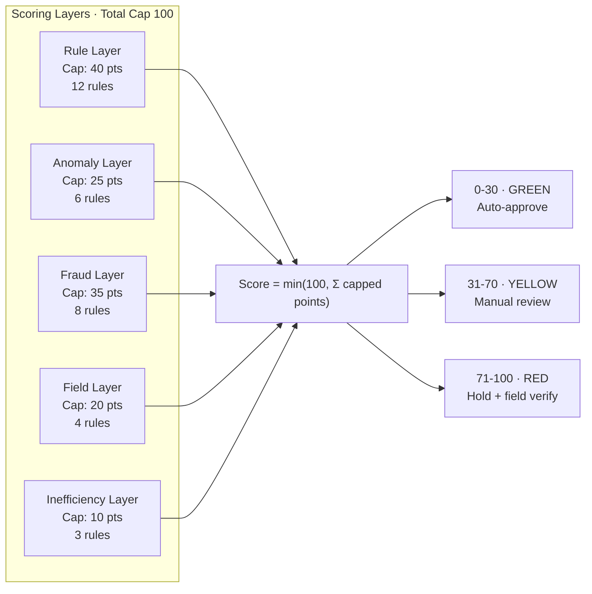
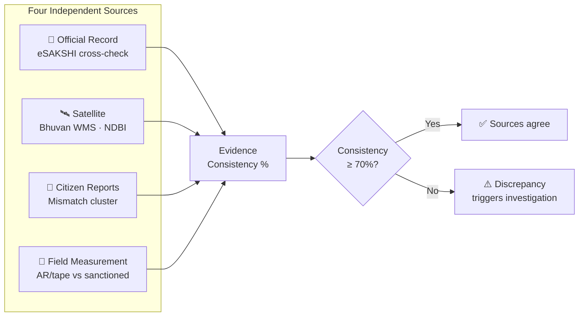
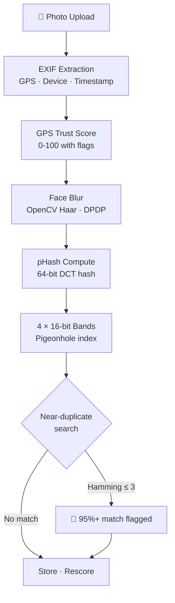
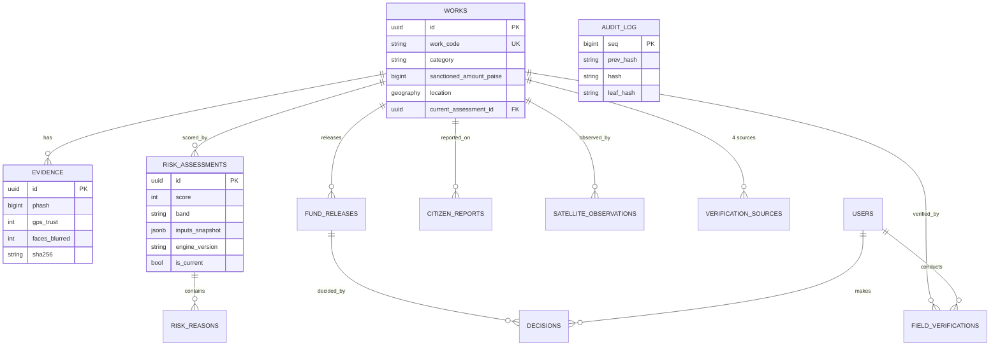

<div align="center">

# MPLAD SATYA

### Systematic Audit & Transparent Yardstick Application

**SIH 2026 · PS SIH26102 · Ministry of Statistics & Programme Implementation**

AI-powered fraud detection and risk-based fund release for India's MPLAD scheme — ₹2,715 Cr/year across 543 constituencies.

[](https://python.org)
[](https://fastapi.tiangolo.com)
[](https://postgresql.org)
[]()
[]()
[](LICENSE)

</div>

---

## What SATYA Does

SATYA is an evidence-based audit layer for the MPLAD scheme. It scores every public work 0–100 based on four independent verification sources, then gates fund releases on that score.

**SATYA produces evidence and a risk recommendation. Approval remains an administrative action by an authorised officer.**

```
eSAKSHI Record + Satellite Imagery + Citizen Reports + Field Measurement
    ↓                  ↓                   ↓                ↓
Cross-verify     NDBI analysis      Mismatch cluster    AR/tape measure
    ↓                  ↓                   ↓                ↓
              ┌────────────────────────────────────┐
              │     SATYA Risk Engine (33 rules)   │
              │   Additive scoring, per-category   │
              │   caps, Hamilton apportionment     │
              └──────────┬─────────────────────────┘
                         │
              Score 0-100 + ordered reasons
                         │
         ┌───────────────┼───────────────┐
     0-30 GREEN      31-70 YELLOW     71-100 RED
    Auto-approve    Manual review    Hold + field verify
```

---

## Architecture


---

## Risk Scoring Model

The score is **additive with per-category caps**, not a weighted average. Each reason contributes points, and the displayed reasons sum **exactly** to the gauge number via Hamilton apportionment.



### Example: Hero Work MP/2026/1142

| # | Reason | Points | Category |
|---|--------|--------|----------|
| 1 | Cost 2.9× CPWD benchmark | 24 | Anomaly |
| 2 | Geo-duplicate 8m from similar work | 18 | Fraud |
| 3 | Photo 95% match with another work | 16 | Fraud |
| 4 | Field measurement 52m vs 100m sanctioned | 15 | Field |
| 5 | Timeline 52 days overdue | 5 | Inefficiency |
| | **Total** | **78** | **HIGH RISK** |

The 33 rules are declarative JSON, evaluated by `simpleeval`. Every assessment stores `engine_version` + `rules_sha256` + `inputs_snapshot` for full reproducibility.

---

## 4-Source Verification Pipeline



**Design principle**: Inconclusive sources (e.g. satellite can't resolve a 3m road at 2.5 m/px) are excluded from both numerator and denominator — "the sensor cannot see this" is not evidence of wrongdoing.

---

## Evidence Upload Pipeline



**GPS Trust Flags**: `mock_location_flag`, `gps_offset_{N}m`, `suspiciously_precise_gps`, `no_capture_timestamp`, `no_device_info`

---

## API Surface — 40 Endpoints

| Group | Endpoints | Auth |
|-------|-----------|------|
| **Auth** | OTP request/verify, refresh, logout, me | Public (OTP) |
| **Works** | List, detail, map (GeoJSON bbox), search | JWT |
| **Risk** | Score breakdown, 4-source verification, history, recompute | JWT |
| **Evidence** | Upload (full pipeline), list per work | JWT |
| **eSAKSHI** | Official record, cross-verification | JWT |
| **Satellite** | Trigger observation, history | JWT |
| **Dashboard** | Field counters, priority list, start/submit verification | JWT |
| **Decisions** | Fund release queue, summary (₹ totals), approve/hold | JWT + Role |
| **Citizen** | Nearby works, submit report | JWT |
| **Sync** | Pull (trailing watermark), push (idempotent) | JWT |
| **Analytics** | Overview, category-risk, district, top-risk, rule frequency | JWT |
| **Admin** | Rules (transparent), audit verify, stats, demo reset | Mixed |
| **Ops** | `/healthz` (liveness), `/readyz` (version + PostGIS) | Public |

Full OpenAPI spec at `/docs` when the server is running.

---

## Data Model



**Money is integer PAISE everywhere.** ₹15.60 Lakh = `156_000_000`. Never float.

---

## Security Model

See [SECURITY.md](SECURITY.md) for full details.

| Layer | Mechanism |
|-------|-----------|
| Auth | Phone OTP → JWT (30-day, revocable via `token_version`) |
| RBAC | `require_role()` on sensitive routes; citizen can't approve releases |
| Audit | SHA-256 hash chain, append-only trigger + REVOKE on audit_log |
| Privacy | DPDP: face blur on ingest, `reporter_hash` pseudonymisation |
| Fail-closed | Production refuses to boot with `SMS_PROVIDER=console` or `DEMO_MODE=true` |

---

## Quick Start

```bash
# Clone and setup
git clone https://github.com/utkarsh684/MPLAD-SATYA.git
cd MPLAD-SATYA/server

# Install dependencies
pip install uv
uv sync

# Configure
cp .env.example .env
# Edit .env: DATABASE_URL, JWT_SECRET (≥32 chars)

# Database
docker compose up -d db
alembic upgrade head
python -m app.seed.generate --works 2000 --seed 42

# Run
uvicorn app.main:app --reload --port 8000

# Test
pytest tests/ -q
# 110 passed
```

### Demo Logins

| Phone | Role | Scope |
|-------|------|-------|
| +919000000001 | MoSPI Admin | All districts |
| +919000000002 | District Officer | Bhopal |
| +919000000003 | Field Officer | Bhopal |
| +919000000004 | MP | Bhopal constituency |
| +919000000005 | Citizen | Nearby works |

SMS provider is `console` in dev — the OTP prints to stdout.

---

## Project Structure

```
server/
├── app/
│   ├── main.py              # FastAPI app, lifespan, CORS, error handlers
│   ├── config.py             # Pydantic settings, fail-closed validators
│   ├── db.py                 # SQLAlchemy engine (pool_pre_ping for Neon)
│   ├── models.py             # 16 tables, one file (no circular imports)
│   ├── schemas.py            # Pydantic v2 request/response models
│   ├── deps.py               # current_user, require_role() dependencies
│   ├── security.py           # JWT, OTP hash, phone pseudonymisation
│   ├── errors.py             # Single error envelope
│   ├── serializers.py        # ORM → response conversion
│   ├── satellite.py          # FixtureAdapter + BhuvanAdapter (WMS + NDBI)
│   ├── audit.py              # Hash chain: append, verify, canonical JSON
│   ├── routers/
│   │   ├── auth.py           # OTP flow, refresh, logout
│   │   ├── works.py          # List, detail, map, risk, verification
│   │   ├── evidence.py       # Upload pipeline (EXIF→pHash→blur→store)
│   │   ├── esakshi.py        # Official record cross-verification
│   │   ├── satellite.py      # Trigger observation, history
│   │   ├── dashboard.py      # Field officer counters + priority list
│   │   ├── decisions.py      # Fund release queue + approve/hold
│   │   ├── citizen.py        # Nearby works, submit report
│   │   ├── sync.py           # Offline pull/push with idempotency
│   │   ├── analytics.py      # Overview, category-risk, top-risk
│   │   └── admin.py          # Rules, audit verify, demo reset
│   ├── risk/
│   │   ├── engine.py         # Pure scoring function, 33 rules
│   │   ├── rules.json        # Declarative rulebook
│   │   ├── weights.yaml      # Category caps, band thresholds
│   │   ├── facts.py          # DB → facts dict (z-score, IForest, etc.)
│   │   ├── consistency.py    # 4-source verdicts + consistency %
│   │   ├── service.py        # Orchestration: facts → assess → persist
│   │   ├── signals.py        # Reason/AssessmentResult dataclasses
│   │   └── format.py         # Template rendering (₹ lakh/crore, etc.)
│   ├── services/
│   │   ├── phash.py          # 64-bit DCT hash, pigeonhole lookup
│   │   ├── anomaly.py        # IsolationForest + z-score
│   │   ├── exif.py           # EXIF extraction, GPS trust, face blur
│   │   ├── esakshi.py        # eSAKSHI adapter
│   │   ├── storage.py        # Local/R2 file storage
│   │   └── push.py           # FCM HTTP v1 notifications
│   └── seed/
│       ├── generate.py       # Deterministic seeder (--seed 42)
│       └── fixtures/         # Planted cases + CPWD rates
├── alembic/                  # 3 migrations (schema, audit trigger, sync rev)
├── tests/                    # 110 tests, 9 files
├── Dockerfile
├── render.yaml
└── pyproject.toml
```

---

## Deployment

| Component | Service | Cost |
|-----------|---------|------|
| API | Render Starter | $7/mo |
| Database | Neon PostgreSQL (PostGIS) | Free |
| Photos | Cloudflare R2 (10 GB) | Free |
| **Total** | | **$7/mo** |

```bash
# Deploy
render deploy  # or git push to connected repo

# Pre-deploy runs alembic migrate automatically (render.yaml)
# Health check: GET /healthz
```

---

## Testing

```bash
pytest tests/ -q                      # All 110 tests
pytest tests/test_risk_engine.py -v   # Golden test: hero = 78
pytest tests/test_phash.py -v         # Pigeonhole, signed roundtrip
pytest tests/test_rbac.py -v          # Every route is auth'd or explicitly public
pytest tests/test_audit_canonical.py  # Pinned digests, tamper detection
pytest tests/test_exif.py             # GPS trust scoring
pytest tests/test_satellite.py        # Detectability, adapters
```

**Key invariants tested:**
- Hero work MP/2026/1142 scores exactly 78 with 5 specific reasons
- Points always sum to score (400 random works, Hamilton apportionment)
- Every rule is reachable (no dead rules)
- Every route is authenticated or explicitly public (no accidental exposure)
- Audit chain detects single-bit tamper
- pHash signed↔unsigned roundtrip (2000 random hashes)

---

## Design Decisions

| Decision | Why |
|----------|-----|
| Additive scoring, not weighted average | Reasons on screen sum to the gauge number — arithmetic explainability |
| 33 JSON rules + simpleeval, not ML classifier | No labelled fraud dataset exists; rules cite specific guideline clauses |
| pHash with pigeonhole bands, not vector DB | 64-bit hash + 4 btree lookups beats a 500 MB FAISS index at 2000 works |
| Integer paise, never float | ₹15.60L = 156,000,000 paise. Float arithmetic on money is a compliance bug |
| Hash chain, not blockchain | Same tamper-evidence guarantee, zero infrastructure, better demo |
| Append-only facts, no conflict resolution | Immutable events can't conflict — no merge algorithm to write or defend |
| Inconclusive satellite = 0 points | A sensor that can't see must never manufacture suspicion |
| Decisions stored with `ai_score_at_decision` | "Is the AI deciding?" → No. The human decision and the AI recommendation are separate columns |

---

## References

- [MPLADS Guidelines 2023](https://mplads.gov.in) — Annex-II (prohibited works), Annex-IIA (admissible works)
- [eSAKSHI Portal](https://mplads.mospi.gov.in) — Digital end-to-end MPLAD management
- [CAG Performance Audit Reports](https://cag.gov.in) — Irregular clubbing ₹3.21 Cr, UC violations
- [CPWD Delhi Schedule of Rates 2023](https://cpwd.gov.in) — Benchmark rates for cost comparison
- [Bhuvan WMS](https://bhuvan.nrsc.gov.in) — ISRO satellite imagery layers
- [PFMS](https://pfms.nic.in) — Public Financial Management System for TSA/Hybrid releases

---

## License

[MIT](LICENSE)

---

<div align="center">

**SIH 2026 · Team SATYA Coders · NIT Hamirpur**

*"SATYA provides evidence, not verdicts. Approval is an administrative action by an authorised officer."*

</div>
