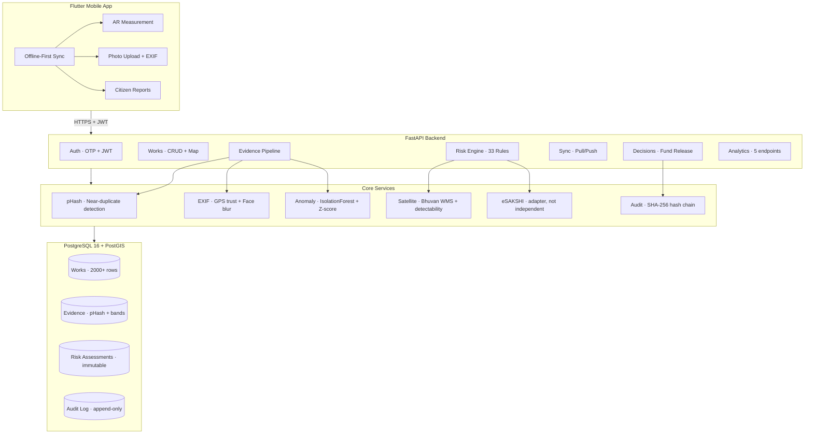
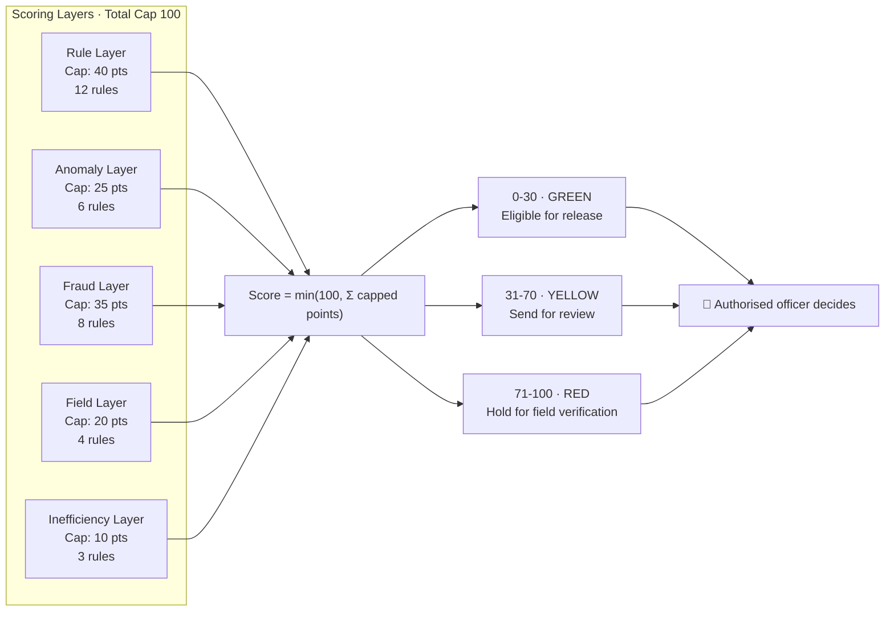
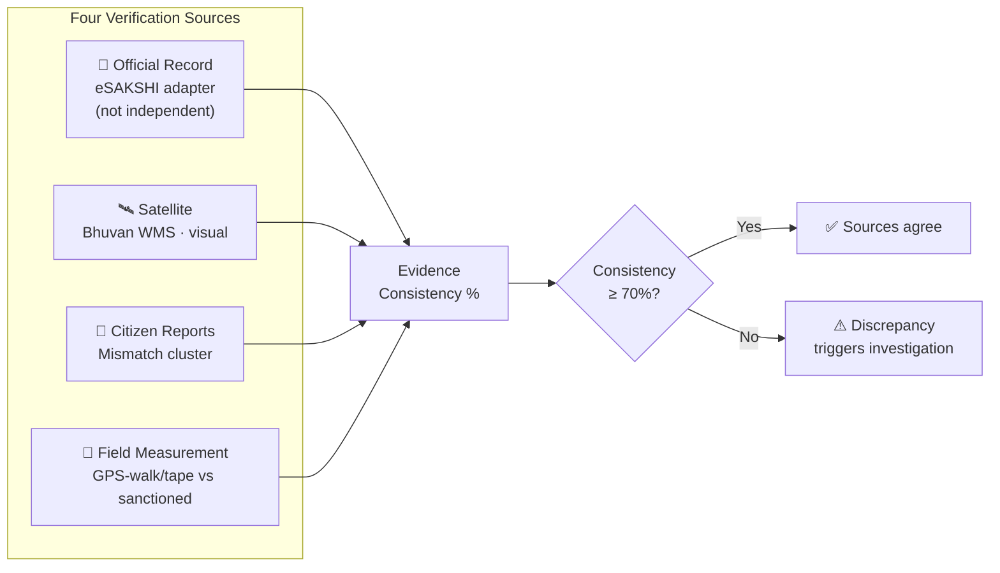
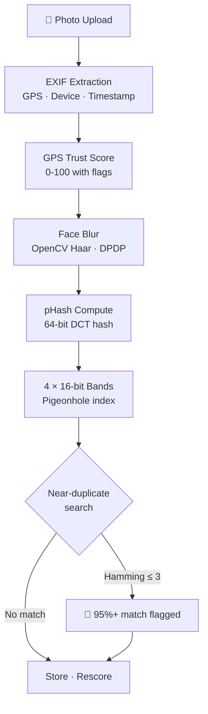
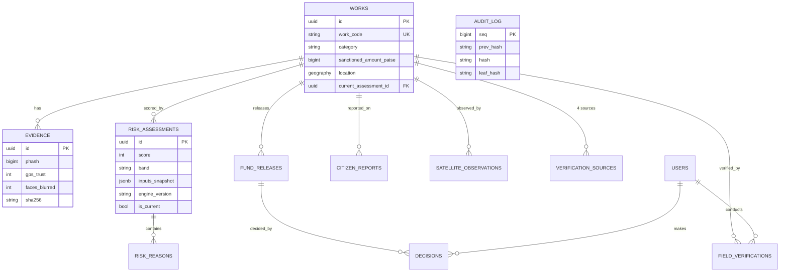

<div align="center">


# MPLAD SATYA

### Systematic Audit & Transparent Yardstick Application

**SIH 2026 · PS SIH26102 · Ministry of Statistics & Programme Implementation**

Evidence-based anomaly detection and risk triage for India's MPLAD scheme — ₹2,715 Cr/year across 543 constituencies.

**SATYA provides evidence, not verdicts. Approval remains an administrative action by an authorised officer.**

[](https://python.org)
[](https://fastapi.tiangolo.com)
[](https://postgresql.org)
[]()
[]()
[](LICENSE)

</div>

---

## What SATYA Does

SATYA is an evidence-based audit layer for the MPLAD scheme. It scores every public work 0–100 by cross-checking four verification sources, and surfaces the reasoning to the officer who decides.

**The score is an investigation priority, not a fraud probability.** A work scoring 80 is not "80% likely to be fraudulent" — it means several checks disagreed with the record, and it should be looked at before a work scoring 20.

SATYA never approves, holds or rejects a fund release. It assembles evidence and recommends; the decision recorded against a release belongs to an authorised officer, with their justification, written to a tamper-evident log alongside the score that was on screen at the time.

> Not every source is independent of SATYA, and the app says which. See [Data provenance](#data-provenance--what-is-real-and-what-is-not).


---

## Data provenance — what is real, and what is not

Every figure SATYA shows is traceable to one of these. Nothing is simulated
without being labelled as simulated, in the API **and** on screen.

| Source | State | Independent of SATYA? | Notes |
|---|---|---|---|
| **OpenStreetMap** tiles | 🟢 LIVE | Yes | Raster tiles, attribution rendered per licence |
| **Nominatim** geocoding | 🟢 LIVE | Yes | Place search, throttled to 1 req/s with an identifying User-Agent per their usage policy. Never used for bulk geocoding |
| **Field evidence** | 🔵 LOCAL | n/a — it is our own data | Real uploads: sha256, EXIF, GPS trust, face blur, pHash, near-duplicate search |
| **CPWD DSR 2024** | 🔵 OFFICIAL | Yes | Published schedule of rates, transcribed with item-level references (`CPWD DSR 2024 Vol-I item 16.42`). CPWD publishes no API |
| **ISRO Bhuvan** | 🔴 LIVE call succeeds, returns **UNAVAILABLE** | Yes | Endpoint verified reachable 2026-09-10. The public `bhuvan-vec2` service publishes *thematic vector* layers, not per-location imagery — a real key is required. A live call honestly reports `unavailable`; `fixture` remains the default. [Details](#on-satellite--what-it-can-and-cannot-say) |
| **eSAKSHI** | 🟠 DEMO ADAPTER | **No** | MoSPI publishes no public REST API |

### On eSAKSHI

The adapter is shaped like an external source but currently reads the **same
database**. It exercises the comparison pipeline end to end; it does **not**
independently corroborate anything. The Official tab states this on screen, so
no officer can mistake a pipeline check for external confirmation. When MoSPI
grants access, only the adapter's `_fetch` method changes.

We do not claim "connected to the eSAKSHI API", because we are not.

### On satellite — what it can and cannot say

Two claims were deliberately removed from this feature because the data does
not support them:

- **It does not compute NDBI.** NDBI is `(SWIR − NIR) / (SWIR + NIR)`. Bhuvan's
  public WMS returns a *rendered visual PNG* with no SWIR and no NIR band, so a
  true built-up index cannot be derived from it. What is computed is a red–green
  brightness contrast, named `brightness_index` throughout and labelled "not
  NDBI" in the UI. It is a weak corroborating hint, nothing more.
- **It does not detect change.** `observe()` fetches one tile. A road built
  twenty years ago produces the same signal as one built last month, so a
  single-date observation cannot establish that work was carried out. A live
  observation therefore tops out at `inconclusive`, and `is_temporal_comparison`
  is `false`. Establishing change needs a before/after pair, which the free
  endpoint does not expose.

Verdict states: `match` · `mismatch` · `inconclusive` · `unavailable`.
A WMS timeout or an undecodable tile is **`unavailable`** — a service outage,
never a finding about the work. An `inconclusive` reading contributes **zero**
points and can never raise a score.

#### What the live endpoint actually returned (verified 2026-09-10)

The Bhuvan path was exercised against the real service, and the result changed
the implementation:

- The hardcoded layer `india3` **does not exist** — the service answers HTTP 200
  with an OGC `LayerNotDefined`. The live path had **never once** produced a
  reading.
- Layers that *do* exist return HTTP 200 `image/png` — but a **flat
  single-colour tile, byte-identical for Bhopal and for Delhi**.

A flat red fill scores **+0.996** on the brightness index. Simply correcting the
layer name would therefore have made every work in India report the same
confident "built-up" signature: fabricated evidence at national scale, produced
by a bug that looked like a fix.

`_is_degenerate_tile()` now rejects any tile with near-zero per-channel spatial
variance regardless of configured layer, so the observation degrades to
`unavailable` with a reason naming the cause. **Only running the real
integration surfaced this** — every unit test with a stubbed tile had passed.

Most MPLADS works are physically smaller than the sensor can resolve, so
`inconclusive` is the *expected* result, not a failure.

### UNKNOWN is never ZERO

Two values that a naive implementation collapses, and that SATYA keeps apart:

| | Meaning |
|---|---|
| `0` | A measurement was taken and the answer is zero |
| `null` | No measurement was possible |

Enforced in code and pinned by tests:
- `consistency_pct` returns `null` when no source was informative — `0%` would
  claim every source *contradicted* the record.
- Satellite detectability fields stay `null` when not computed, never `0.0`/`1.0`.
- A district with no assessments reports `avg_risk_score: null`, so it is not
  painted green as the safest district on the screen.

---

## Architecture



---

## Risk Scoring Model

The score is **additive with per-category caps**, not a weighted average. Each reason contributes points, and the displayed reasons sum **exactly** to the gauge number via Hamilton apportionment — explainability is arithmetic you can check, not a SHAP plot you have to trust.

The caps and band thresholds are **expert-assigned priors, published in the rulebook and tunable per district** — not values learned from data, because no labelled MPLADS fraud dataset exists to learn them from. Saying so is the defensible position; calling them "learned" is not.



### Example: Hero Work MP/2026/1142

| # | Reason | Points | Category |
|---|--------|--------|----------|
| 1 | Cost 2.9× CPWD benchmark | 17 | Anomaly |
| 2 | Field measurement 52 m vs 100 m sanctioned | 15 | Field |
| 3 | Geo-duplicate 8.2 m from a similar work | 13 | Fraud |
| 4 | Photo 95% match with another work | 11 | Fraud |
| 5 | Same photo under a different agency | 11 | Fraud |
| 6 | Unit rate 2.9× the scheduled rate | 8 | Anomaly |
| 7 | Timeline 40 days overdue | 5 | Inefficiency |
| | **Total** | **80** | **HIGH RISK** |
| | Satellite cannot resolve this work | 0 | Field *(procedural)* |

Read this back from the live service yourself:

```bash
./scripts/verify-hero.sh
```

**Why the headline reason shows 17 and not its raw 24.** Two anomaly rules fire
together against a 25-point category cap, and three fraud rules against 35, so
every reason in those categories is scaled down proportionally. The displayed
points still sum to exactly 80 — that is the apportionment doing its job, and
it is the first thing anyone asks when a reason's points differ from the rule's
raw value.

The satellite row is deliberate: a sensor that cannot resolve a 3 m road
contributes **zero**, and is shown rather than hidden so its silence is visible.

The 33 rules are declarative JSON, evaluated by `simpleeval`. Every assessment stores `engine_version` + `rules_sha256` + `inputs_snapshot` for full reproducibility.

---

## 4-Source Verification Pipeline



**Design principle**: Inconclusive sources (e.g. satellite can't resolve a 3m road at 2.5 m/px) are excluded from both numerator and denominator — "the sensor cannot see this" is not evidence of wrongdoing.

---

## Evidence Upload Pipeline



**GPS Trust Flags**: `mock_location_flag`, `gps_offset_{N}m`, `suspiciously_precise_gps`, `no_capture_timestamp`, `no_device_info`

---

## API Surface — 40 Endpoints

| Group | Endpoints | Auth |
|-------|-----------|------|
| **Auth** | OTP request/verify, refresh, logout, me | Public (OTP) |
| **Works** | List, detail, map (GeoJSON bbox), search | JWT |
| **Risk** | Score breakdown, 4-source verification, history, recompute | JWT |
| **Evidence** | Upload (full pipeline), list per work | JWT |
| **eSAKSHI** | Official record, cross-verification | JWT |
| **Satellite** | Trigger observation, history | JWT |
| **Dashboard** | Field counters, priority list, start/submit verification | JWT |
| **Decisions** | Fund release queue, summary (₹ totals), approve/hold | JWT + Role |
| **Citizen** | Nearby works, submit report | JWT |
| **Sync** | Pull (trailing watermark), push (idempotent) | JWT |
| **Analytics** | Overview, category-risk, district, top-risk, rule frequency | JWT |
| **Admin** | Rules (transparent), audit verify, stats, demo reset | Mixed |
| **Ops** | `/healthz` (liveness), `/readyz` (version + PostGIS) | Public |

Full OpenAPI spec at `/docs` when the server is running.

---

## Data Model



**Money is integer PAISE everywhere.** ₹15.60 Lakh = `156_000_000`. Never float.

---

## Security Model

See [SECURITY.md](SECURITY.md) for full details.

| Layer | Mechanism |
|-------|-----------|
| Auth | Phone OTP → JWT (30-day, revocable via `token_version`) |
| RBAC | `require_role()` on sensitive routes; citizen can't approve releases |
| Audit | SHA-256 hash chain, append-only trigger + REVOKE on audit_log |
| Privacy | DPDP: face blur on ingest, `reporter_hash` pseudonymisation |
| Uploads | Bytes are sniffed, not trusted: allowlist `{JPEG,PNG,WEBP,HEIC}`, extension and MIME derived from the **detected** format — never the filename |
| Fail-closed | Production refuses to boot with `SMS_PROVIDER=console` or `DEMO_MODE=true` |

---

## Quick Start

```bash
# Clone and setup
git clone https://github.com/utkarsh684/MPLAD-SATYA.git
cd MPLAD-SATYA/server

# Install dependencies
pip install uv
uv sync
source .venv/bin/activate   # every command below needs this

# Configure
cp .env.example .env
# Edit .env: DATABASE_URL, JWT_SECRET (≥32 chars)

# Database
docker compose up -d db
alembic upgrade head
python -m app.seed.generate --works 2000 --seed 42
# Scoring 2000 works takes a while. If the connection drops partway,
# re-run with --resume; it scores only what is still unscored.

# Run
uvicorn app.main:app --reload --port 8000

# Test
pytest tests/ -q
# 245 passed
```

### Demo Logins

| Phone | Role | Scope |
|-------|------|-------|
| +919000000001 | MoSPI Admin | All districts |
| +919000000002 | District Officer | Bhopal |
| +919000000003 | Field Officer | Bhopal |
| +919000000004 | MP | Bhopal constituency |
| +919000000005 | Citizen | Nearby works |

SMS provider is `console` in dev — the OTP prints to stdout.

---

## Project Structure

```
server/
├── app/
│   ├── main.py              # FastAPI app, lifespan, CORS, error handlers
│   ├── config.py             # Pydantic settings, fail-closed validators
│   ├── db.py                 # SQLAlchemy engine (pool_pre_ping for Neon)
│   ├── models.py             # 16 tables, one file (no circular imports)
│   ├── schemas.py            # Pydantic v2 request/response models
│   ├── deps.py               # current_user, require_role() dependencies
│   ├── security.py           # JWT, OTP hash, phone pseudonymisation
│   ├── errors.py             # Single error envelope
│   ├── serializers.py        # ORM → response conversion
│   ├── satellite.py          # FixtureAdapter + BhuvanAdapter (WMS + detectability)
│   ├── audit.py              # Hash chain: append, verify, canonical JSON
│   ├── routers/
│   │   ├── auth.py           # OTP flow, refresh, logout
│   │   ├── works.py          # List, detail, map, risk, verification
│   │   ├── evidence.py       # Upload pipeline (EXIF→pHash→blur→store)
│   │   ├── esakshi.py        # Official record cross-verification
│   │   ├── satellite.py      # Trigger observation, history
│   │   ├── dashboard.py      # Field officer counters + priority list
│   │   ├── decisions.py      # Fund release queue + approve/hold
│   │   ├── citizen.py        # Nearby works, submit report
│   │   ├── sync.py           # Offline pull/push with idempotency
│   │   ├── analytics.py      # Overview, category-risk, top-risk
│   │   └── admin.py          # Rules, audit verify, demo reset
│   ├── risk/
│   │   ├── engine.py         # Pure scoring function, 33 rules
│   │   ├── rules.json        # Declarative rulebook
│   │   ├── weights.yaml      # Category caps, band thresholds
│   │   ├── facts.py          # DB → facts dict (z-score, IForest, etc.)
│   │   ├── consistency.py    # 4-source verdicts + consistency %
│   │   ├── service.py        # Orchestration: facts → assess → persist
│   │   ├── signals.py        # Reason/AssessmentResult dataclasses
│   │   └── format.py         # Template rendering (₹ lakh/crore, etc.)
│   ├── services/
│   │   ├── phash.py          # 64-bit DCT hash, pigeonhole lookup
│   │   ├── anomaly.py        # IsolationForest + z-score
│   │   ├── exif.py           # EXIF extraction, GPS trust, face blur
│   │   ├── esakshi.py        # eSAKSHI adapter
│   │   ├── storage.py        # Local/R2 file storage
│   │   └── push.py           # FCM HTTP v1 notifications
│   └── seed/
│       ├── generate.py       # Deterministic seeder (--seed 42)
│       └── fixtures/         # Planted cases + CPWD rates
├── alembic/                  # 3 migrations (schema, audit trigger, sync rev)
├── tests/                    # 151 tests, 11 files
├── Dockerfile
├── render.yaml
└── pyproject.toml

src/                              # Flutter client (Android · iOS · Web)
├── lib/
│   ├── core/
│   │   ├── config.dart           # Build-time API endpoint (--dart-define)
│   │   ├── routing/              # go_router + auth redirect guard
│   │   ├── services/             # GPS, geocoding (Nominatim), device id
│   │   └── theme/                # Palette, theme, RiskBand (server bands)
│   ├── data/
│   │   ├── api/                  # HTTP client, JWT refresh, error envelope
│   │   ├── models/               # Mirror server/app/schemas.py exactly
│   │   └── repositories/         # One per domain
│   ├── providers/                # Auth, outbox, server status, theme, locale
│   ├── features/                 # One folder per screen
│   └── widgets/
│       ├── provenance.dart       # SourceState + chips (single vocabulary)
│       ├── profile_menu.dart     # Top-right identity control
│       └── async_view.dart       # Loading / error / empty, one place
├── assets/logo.png
└── test/                         # Model parsing, provenance, null semantics
```


---

## Mobile app (Flutter)

The officer-facing client lives in `src/`. It reads live data from the API on
every screen — there is no bundled sample data and no offline demo mode baked
into the app.

```bash
cd src
flutter pub get

# Android emulator against a local server (10.0.2.2 is the host machine)
flutter run --dart-define=API_BASE_URL=http://10.0.2.2:8000

# Physical phone over USB, no network involved
adb reverse tcp:8000 tcp:8000
flutter run --dart-define=API_BASE_URL=http://localhost:8000

# Release APK - the form that is actually verified, against config/render.json
flutter build apk --release --dart-define-from-file=config/render.json
```

That build produces `build/app/outputs/flutter-apk/app-release.apk` (61 MB)
with the endpoint compiled in. It is signed with the **Android debug key**,
because the project carries no release signing config: it sideloads and runs,
but it cannot be published, and a rebuild elsewhere gets a different key.

The API endpoint is a **build-time constant** — there is no in-app server
picker, and the endpoint plus live server status is shown on the login screen
and in Settings, so a device pointed at the wrong host is obvious immediately.

**Release builds require HTTPS.** `network_security_config.xml` denies cleartext
in release, so a signed APK cannot send a session token or a site photograph
over plaintext HTTP. Debug builds override this for local development.

### Navigation

The bottom bar is **entirely operational** — it answers *"what do I need to
investigate about this work?"*. Identity and configuration live behind the
top-right profile control instead, so they never compete with the working path.

```
Work detail tabs   Risk · Sources · Evidence · Official · Satellite
Profile menu       Profile · Appearance · Settings · Help · About · Sign out
```

### Offline behaviour

Field verifications and evidence photographs go through an on-disk outbox.
Offline they queue and replay when the connection returns; the server
deduplicates on `client_uuid`, so a replay can never double-count. The pending
count beside the profile avatar is the real queue depth.

Reads are **not** cached — a screen that cannot reach the server says so rather
than presenting stale numbers as current.

### Progressive disclosure

An officer should not have to parse a brightness index to learn that satellite
could not resolve an asset. Screens lead with the plain-language answer and fold
the technical working behind *View technical details*:

```
Detectability   BELOW SENSOR LIMIT
Observation     Cannot confirm from a single image
Source          ● FIXTURE · Offline fixture
                Independent of SATYA   Yes

View technical details ▸   brightness contrast, ratio, method, provider
```

---

## Deployment

### Render + Neon — read this first

`render.yaml` sits at the **repository root** with `rootDir: server`, because
Render only auto-detects a Blueprint at the root. Deploy with
**New → Blueprint**, point it at the repo, and every setting below is applied
automatically — there is no form to fill in.

If you wire the service up by hand instead, the monorepo needs:

| Dashboard field | Value |
|---|---|
| Root Directory | `server` |
| Dockerfile Path | *leave blank* — the Blueprint uses the Python runtime, not Docker |
| Build Command | `pip install .` |
| Pre-Deploy Command | `alembic upgrade head` |
| Start Command | `uvicorn app.main:app --host 0.0.0.0 --port $PORT --workers 2 --proxy-headers --no-access-log` |
| Health Check Path | `/healthz` |

Only set Dockerfile Path if you deliberately choose the Docker runtime, in
which case it is `./server/Dockerfile` (relative to the repo root) and you
should leave Root Directory blank so the build context still contains
`pyproject.toml`.


`render.yaml` deploys with **`ENV=staging`, not `production`**, and that is
deliberate.

`config.py` is fail-closed: `ENV=production` **refuses to boot** while
`SMS_PROVIDER=console`. So production forces `SMS_PROVIDER=msg91`, which needs
a funded MSG91 account. Without those credentials the service would come up
healthy and **every sign-in would fail** — running, and completely unusable.
That is a worse outcome than not starting at all, which is why the shipped
config does not do it.

`staging` keeps console OTP delivery. That is **not** a bypass: the code is
generated, hashed, expiry-bound and attempt-limited exactly as in production —
it is returned in the response instead of being texted. The login screen says
so on screen, and `/readyz` publishes `env` and `demo_mode`, so nothing is
concealed from a judge.

**Neon must have PostGIS enabled** before the first deploy, or
`alembic upgrade head` fails on migration `0001`:

```sql
CREATE EXTENSION IF NOT EXISTS postgis;
```

Set in the Render dashboard (never in git): `DATABASE_URL`, `JWT_SECRET`
(≥32 chars).

To go to real production later: provision MSG91, set `MSG91_AUTH_KEY` and
`MSG91_TEMPLATE_ID`, then flip `ENV=production` and `SMS_PROVIDER=msg91`. The
MSG91 sender is implemented and its credentials are validated at boot, so a
misconfigured deploy fails immediately rather than at an officer's first login.

### Details


| Component | Service | Cost |
|-----------|---------|------|
| API | Render Starter | $7/mo |
| Database | Neon PostgreSQL (PostGIS) | Free |
| Photos | Cloudflare R2 (10 GB) | Free |
| **Total** | | **$7/mo** |

```bash
# Deploy
render deploy  # or git push to connected repo

# Pre-deploy runs alembic migrate automatically (render.yaml)
# Health check: GET /healthz
```

---

## Testing

### Backend — 151 tests

```bash
cd server
pytest -q                                # All 151
ruff check .                             # Lint

pytest tests/test_risk_engine.py         # Golden hero = 80 · band boundaries
pytest tests/test_upload_security.py     # Stored-XSS / file-type rejection
pytest tests/test_provenance_semantics.py# UNKNOWN is never ZERO
pytest tests/test_satellite.py           # Detectability, LIVE vs FIXTURE, failure states
pytest tests/test_rbac.py                # Every route auth'd or explicitly public
pytest tests/test_audit_canonical.py     # Pinned digests, tamper detection
pytest tests/test_phash.py               # Pigeonhole, signed roundtrip
```

### Mobile

```bash
cd src && flutter analyze && flutter test
```

**Key invariants tested:**
- Hero work `MP/2026/1142` scores exactly **80** with 7 specific reasons — CI
  fails before a judge sees a drift, and `./scripts/verify-hero.sh` reads the
  same number back from the deployed service over HTTP
- Reason points always sum to the score (Hamilton apportionment, 400 random works)
- Band boundaries exact at `0·1·30·31·70·71·99·100`
- Every rule is reachable — no dead rules
- Every route is authenticated or explicitly public
- Audit chain detects a single-bit tamper
- pHash signed↔unsigned roundtrip (2000 random hashes)
- **An inconclusive satellite reading adds zero points**
- **A single-pass observation can never return `match`**
- **A WMS outage is `unavailable`, never a finding about the work**
- **`consistency_pct` is `null`, not `0`, when no source was informative**
- **HTML/SVG/PDF/ELF uploads are rejected; the stored extension comes from
  sniffed bytes, never the filename**


---

## What the engine does on 2,000 works

Run against the full seeded dataset on Postgres, not in a unit test. The six
planted cases are excluded so the figure measures the engine on works it was
not built to catch:

| | Works | Green | Yellow (review) | Red (hold) |
|---|---|---|---|---|
| Ordinary, generated at benchmark cost ±20% | 1,994 | 1,969 (98.75%) | 25 (1.25%) | **0** |
| Planted | 6 | 3 | 2 | 1 |

**Not one of 1,994 synthetic clean works reaches the red band.** The 25 that
reach yellow are asking for a second look, which is what yellow means; none of
them is accused of anything.

This is offered instead of a precision figure. Precision against generated
fraud is circular - the same code writes the fraud and finds it - and a judge
will say so. What is checkable is the shape above: the engine is quiet on works
that look normal, and the one work it holds is the one built to be held.

`GEO_DUPLICATE` fires exactly **twice** across all 2,000 works: the planted
pair, 8.2 m apart, each seeing the other. Zero false positives on the other
1,998.

The planted anchor is the more interesting row. `MP/2026/1140` carries the same
geo-duplicate reason as the hero and still scores **18, green** - it has the
duplicate location but none of the cost, photo or measurement signals. One
signal does not condemn a work, and the arithmetic shows why rather than
asserting it.

---

## Known limitations

Stated plainly, because a limitation a judge discovers is worth far less than
one you declared first.

| Limitation | Status |
|---|---|
| **eSAKSHI is not an independent source** | No public REST API exists. The adapter reads our own database and the UI says so. Pipeline is ready; the integration is not |
| **Satellite cannot confirm most MPLADS works** | Cartosat resolves ~2.5 m; a ward drain is ~1 m. `inconclusive` is the expected verdict and adds zero points |
| **Satellite cannot detect change** | Single-date imagery only. Establishing that work happened needs a before/after pair the free WMS does not expose |
| **`brightness_index` is not a remote-sensing index** | It is a red–green contrast over a rendered visual tile, used only as a weak hint |
| **No labelled fraud dataset** | Thresholds are expert priors, not learned parameters. Precision and recall against real outcomes are unmeasured, and the figures above are specificity on generated data - they say the engine is quiet on normal works, not that it catches real fraud |
| **Anomaly ≠ fraud** | Terrain, haulage distance, phased works and genuine repeat designs all produce the same signals as misuse |
| **Citizen reports are unweighted by reputation** | A coordinated group could file matching reports. Mitigated only by cross-source consistency today |
| **GPS can be spoofed** | Mock-location is detected and flagged into the trust score, but a determined spoof on a rooted device is not fully defeated |
| **Tokens in `SharedPreferences`** | Readable on a rooted device. `flutter_secure_storage` is the upgrade path; access tokens are short-lived |
| **Rejected sync items are not auto-retried** | By design — the server will never accept them. They are surfaced in Settings rather than dropped, and must be re-recorded manually |
| **APK is debug-signed** | The release APK builds (61 MB, `com.mpladsatya.mplad_satya` 1.0.0, targetSdk 36) and carries the Render URL compiled in, but there is no release signing config, so it is signed with the Android debug key. Sideloads and runs; cannot go to Play, and a rebuild on another machine produces a different key, so an in-place upgrade fails |
| **APK never run on a physical device** | `flutter analyze` (clean), `flutter test` (38 passed) and `flutter build apk --release` (succeeds) have all been run. No Android device or emulator was available, so nothing here proves the app behaves correctly once installed |
| **Bhuvan live returns UNAVAILABLE** | The endpoint is reachable and the request genuinely succeeds, but the public service serves thematic vector layers rather than per-location imagery. Needs a registered ISRO API key |
| **Only English and Hindi** | The other seven language maps are 11–25 % complete and are deliberately withheld from the picker. `test/localization_test.dart` fails the build if the advertised list runs ahead of the translations |

### Found only by running against a real database

`assess()` is a pure function, so the golden test scores `MP/2026/1142`
without ever touching Postgres. That is why 189 passing tests hid three bugs
that each made the hero scenario **impossible to persist**. All three surfaced
within minutes of pointing the seeder at a real Supabase instance:

| Bug | Effect |
|---|---|
| `reason_cat_t` never defined `'field'` | 4 of 33 rules — including `MEASUREMENT_MISMATCH`, one of the hero's seven scoring reasons — failed to `INSERT` |
| `Numeric` columns returned `Decimal` while annotated `float` | The facts dict is JSONB; one `Decimal` broke **every** `score_work()` |
| `WKBElement` bound into raw SQL | psycopg3 cannot adapt it; aborted the whole facts build, so `GEO_DUPLICATE` (raw weight 18, shown as 13 on the hero once the fraud cap is applied) never fired |

Together they are why the seeder's self-check refused to reproduce the hero's
documented score. Each one crashed on contact with Postgres, which is the only
reason they were found in minutes rather than at a demo.

The lesson is recorded here rather than quietly fixed: a pure-function test
suite proves the arithmetic, never the persistence. `tests/test_rulebook_schema.py`
and `tests/test_api_smoke.py` now cover the seams that unit tests structurally
cannot reach.

### The one that did not announce itself

A fourth bug is worth separating from those three, because they all crashed
and it did not.

`GEO_DUPLICATE` stopped firing on every work in the database, and every score
stayed plausible. No exception reached a log. The hero read **77**; the other
1,999 works were quietly under-scored, and nothing in the system said so.

The chain was four links long, and only the last one is interesting:

1. `_lat_lon()` decoded the stored point to floats with geoalchemy2's `to_shape`
2. `to_shape` requires Shapely, which was absent from that environment
3. the resulting `ImportError` was caught by a bare `except Exception`
4. the caller read the empty result as **"this work has no location"**

A work with no location genuinely has no neighbours to duplicate, so the
fraud signal disappeared without ever looking like a failure. The scores it
left behind were the problem: wrong, but reasonable enough that only a fixture
expecting an exact number caught them.

Two fixes, and the second is the one that matters:

- The geometry never needed to leave the database. Both geo facts now use the
  work's own location in place — no decode, no Shapely, and no dependency
  whose absence can subtract a finding.
- The same shape of default was worse in the evidence pipeline, which fell
  back to Bhopal's coordinates. A photo could be checked for GPS drift against
  a location nobody had claimed for that work, manufacturing a distance and a
  verdict out of a default. An unknown location is now reported as
  `work_location_unknown` and costs no trust points, because an offset that
  cannot be measured is not an offset of zero.

`tests/test_provenance_semantics.py` pins both, and asserts that the geo facts
never reacquire the optional decode.

**A signal that fails loudly costs you a demo. A signal that fails quietly
costs you the claim**, because every number it produced afterwards was wrong
in a direction nobody could see. This is the argument for `UNKNOWN` being a
first-class value throughout SATYA rather than a `None` that some caller
eventually reads as zero.

### What would move each of these

Most are integration or data-access limits rather than engineering gaps — the
adapters, the null semantics and the provenance vocabulary are all already in
place, so an authorised eSAKSHI feed or a licensed before/after imagery source
is a swap of one method, not a rewrite.

---

## Design Decisions

| Decision | Why |
|----------|-----|
| Additive scoring, not weighted average | Reasons on screen sum to the gauge number — arithmetic explainability |
| 33 JSON rules + simpleeval, not ML classifier | No labelled fraud dataset exists; rules cite specific guideline clauses |
| pHash with pigeonhole bands, not vector DB | 64-bit hash + 4 btree lookups beats a 500 MB FAISS index at 2000 works |
| Integer paise, never float | ₹15.60L = 156,000,000 paise. Float arithmetic on money is a compliance bug |
| Hash chain, not blockchain | Same tamper-evidence guarantee, zero infrastructure, better demo |
| Append-only facts, no conflict resolution | Immutable events can't conflict — no merge algorithm to write or defend |
| Inconclusive satellite = 0 points | A sensor that can't see must never manufacture suspicion |
| Decisions stored with `ai_score_at_decision` | "Is the AI deciding?" → No. The human decision and the AI recommendation are separate columns |

---

## References

- [MPLADS Guidelines 2023](https://mplads.gov.in) — Annex-II (prohibited works), Annex-IIA (admissible works)
- [eSAKSHI Portal](https://mplads.mospi.gov.in) — Digital end-to-end MPLAD management
- [CAG Performance Audit Reports](https://cag.gov.in) — Irregular clubbing ₹3.21 Cr, UC violations
- [CPWD Delhi Schedule of Rates 2023](https://cpwd.gov.in) — Benchmark rates for cost comparison
- [Bhuvan WMS](https://bhuvan.nrsc.gov.in) — ISRO satellite imagery layers
- [PFMS](https://pfms.nic.in) — Public Financial Management System for TSA/Hybrid releases

---

## License

[MIT](LICENSE)

---

<div align="center">

**SIH 2026 · Team Lotus · NIT Hamirpur**

*"SATYA provides evidence, not verdicts. Approval is an administrative action by an authorised officer."*

</div>
