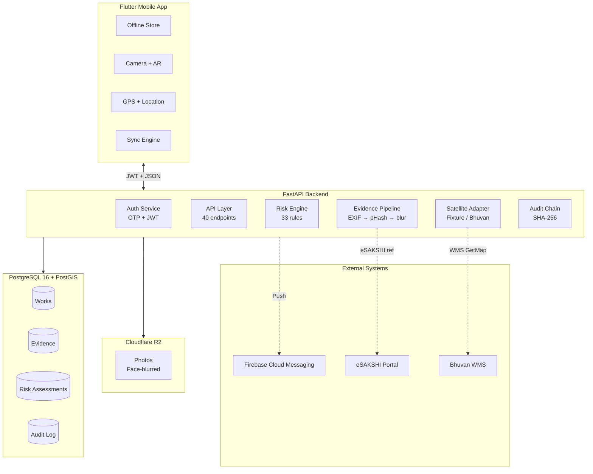
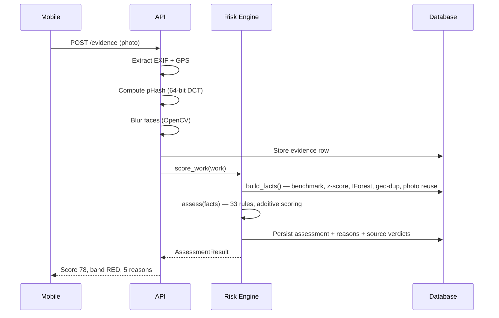
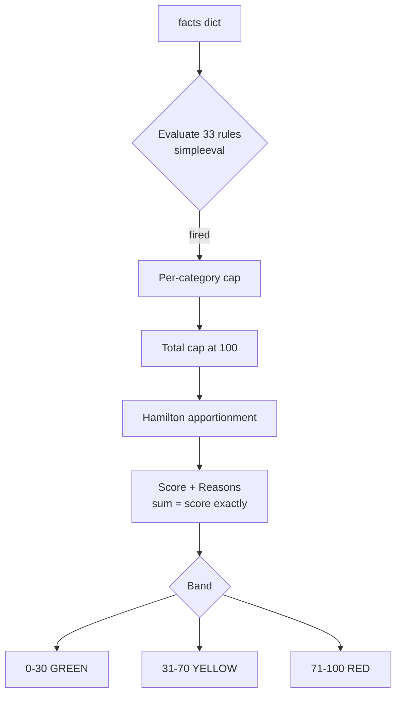
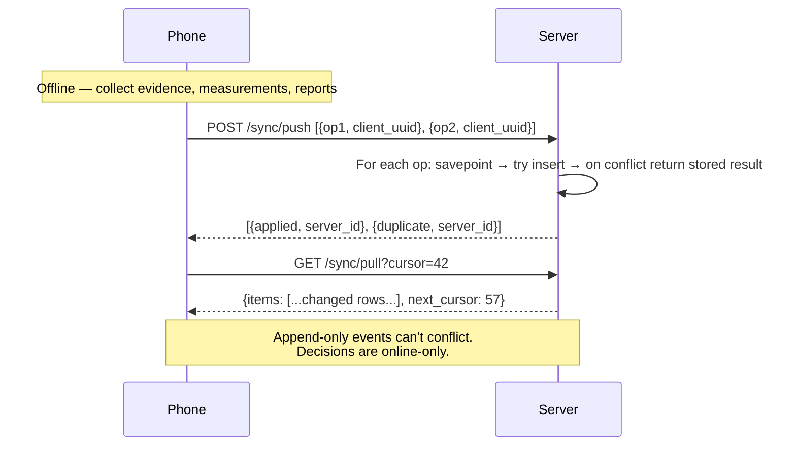

# SATYA Architecture

## System Overview



## Request Flow



## Scoring Flow



## Offline Sync Model



## Deployment

```mermaid
graph LR
    GH[GitHub] -->|push| R[Render]
    R -->|pre-deploy| ALB[alembic upgrade head]
    ALB --> APP[uvicorn · 2 workers]
    APP --> NEON[(Neon PostgreSQL<br/>PostGIS · Free)]
    APP --> R2[(Cloudflare R2<br/>Photos · Free)]
    APP --> HZ[/healthz]
    APP --> RZ[/readyz]
```

| Component | Service | Cost | Why |
|-----------|---------|------|-----|
| API | Render Starter | $7/mo | No cold start (free tier = 50s) |
| Database | Neon Free | $0 | PostGIS, never expires, 0.5 GB |
| Photos | R2 Free | $0 | 10 GB, zero egress |
| Push | FCM | $0 | Free tier covers demo volume |
